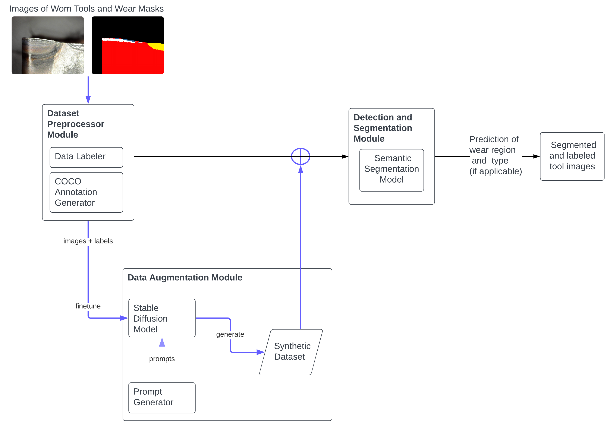

# Stable Diffusion Data Augmentation for Visual Tool Condition Monitoring

## Steps for Running the Detection and Segmentation Pipeline
1. Create a virtual environment (venv) with python>=3.9,<3.12  (TensorFlow 2.16.1 supports Python 3.8–3.11) \
`` python3.10 -m venv {name_of_the_venv} ``

2. Activate venv \
`` source {name_of_the_venv}/bin/activate ``

3. Upgrade pip and install requirements \
`` pip install --upgrade pip `` \
`` pip install -r requirements.txt ``\
`` python -m ipykernel install --user --name={name_of_the_venv} --display-name "Python venv" ``\

4. Install detectron2 (this may take a while)
- ``python -m pip install 'git+https://github.com/facebookresearch/detectron2.git' ``
5. Move Data folder to root \
. \
├── Data \
├── DatasetPreprocessor \
├── Experiments

----------------------
### Segmentation with Mask R-CNN
6. For training Mask R-CNN on FBA dataset:
- Open MaskRCNN/segmenter_config.yaml
    - Check configurations (configure location of train, validation and test sets, hyperparameters for training MaskRCNN and WandB project and experiment name)
- If everything looks fine, for training:
    - ``cd MaskRCNN/`` and run ``python tool_segmentation.py --mode train``
        - The model will be saved in MaskRCNN/{model_output_dir} directory.

        - During training terminal will show MaskRCNN model architecture, expected training time, evaluation results for BBox and Segm. 
        - If you'd like to see the WandB monitoring, just after running the train command, it will display a WandB link. Through this link, training plots can be monitored (this step requires having a WandB account).

7.1. After training finishes, inference on validation and test images can be done via:
- ``python tool_segmentation.py --mode infer-on-val`` or `` python tool_segmentation.py --mode infer-on-test``
    - The evaluation metrics for val or test sets will be displayed in terminal.
    - Prediction visualization will be placed under MaskRCNN/prediction_visualizations/{experiment_name}
    - Inside of the prediction_visualizations folder, comparisons folder will show the ground truth on the left and the prediction result on the right. Predictions folder will only show the model predictions.

7.2. **If you'd like to do inference with an already trained model**
- Copy fba_models folder into MaskRCNN (In this folder, the models mentioned in the experiments section of the thesis can be found.)
    .  
    ├── MaskRCNN  
    │   └── fba_models  
    ├── DatasetPreprocessor  
    ├── Experiments

- Add fba_models to .gitignore
- Pick a model and adjust the segmenter_config.yaml:
    - Let's say that you selected fba_models/real/real only_{experiment_details} model. According to this selection:
        - The experiment_details part is automatically created based on the hyperparameters in the config. 
        - model/output_dir should be adjusted to "./fba_models/real/"
        - wandb/experiment_name should be adjusted to "real only" 
    - Then run `` python tool_segmentation.py --mode infer-on-val`` or `` python tool_segmentation.py --mode infer-on-test`` to see the evaluation results.     
        - Again the prediction results will be placed under MaskRCNN/prediction_visualizations/. 

----------------------
### Segmentation with UNet
For training the UNet, Jupyter Notebook **model_training.ipynb** and for model evaluation **model_evaluation.ipynb** is implemented.
- By running these notebooks, training or inference can be done on the Tool Dataset.
- If you'd like to use already trained models for inference:
    - Copy the V_Unet folder inside of TransferLearningUnet. (if you change the name of the folder, please add it to the .gitignore file)
    - Run model_evaluation.ipynb notebook.

-----------------------
### Stable Diffusion Model Finetuning
> Note: If you prefer to use already trained models to generate images, you can skip ahead to [Generating Images with Finetuned Stable Diffusion Models](#generating-images-with-finetuned-stable-diffusion-models). \
> Note: This step requires a GPU.
8. Clone diffusers library from github and install required packages \
    `` cd ImageGenerationwithStableDiff `` \
    `` git clone https://github.com/huggingface/diffusers `` \
    `` cd diffusers `` \
    `` pip install -e. `` \
    `` cd examples/text_to_image `` \
    `` pip install -r requirements_sdxl.txt `` 

9. Monitoring model training and preparing model output directory: 
- If you'd like to save the model to HuggingFace log in via: \
    `` huggingface-cli login ``
- If you'd like to monitor training process and see the evaluation of generated images: \
    `` pip install wandb ``\
    `` wandb login ``

10. Setup accelerate configuration (enables distributed training)\
    `` accelerate config default ``

11. Configure and copy the training arguments from ImageGenerationwithStableDiff/training_arg_sdxl.txt file (either for Tool or FBA dataset)
    - If report_to="wandb" is used, the training process can be monitored. 

12. Paste the training arguments then press Enter.
    - The training will start. (According to the provided hyperparameters, training may take long time.)
    - In the beginning of the training if wandb is configured, terminal will display a link for monitoring through WandB. 

--------------
### Generating Images with Finetuned Stable Diffusion Models
> Note: This step requires a GPU.
- To generate images for the Tool dataset, run **inference_Tool_images.ipynb**. To generate images for the FBA dataset, run **inference_FBA_images.ipynb**
- After this step, for using generated images in training of the segmentation models, manual annotation is required. For manual annotation, we used online annotation tool https://www.makesense.ai/. The annotations of the generated images can be found inside of the Data/{Tool or FBA dataset}/generated/.

--------------
### Dataset Augmentation with Synthetic Images
After generating images **if you'd like to create augmented datasets from scratch follow these steps**:
- Open Experiments folder (in the root directory of the project)
    - Real datasets can be combined with synthetic images as described in **adding_generated_bue_images.ipynb**. This notebook describes how to create a combined dataset. 
    - After combining the real and the synthetic images, new augmented training dataset can be created. 
    - MaskRCNN model can be trained on the combined dataset by adjusting the training dataset path field of the MaskRCNN/segmenter_config.yaml. 
    - UNet model can be trained on the combined dataset by changing the training dataset path in the **model_training.ipynb**.

Otherwise **if you'd like to use already prepared datasets follow these steps**:
- Prepared datasets can be found in Data/{Tool or FBA dataset}/experiments/. 
- MaskRCNN model can be trained on the prepared dataset by adjusting the training dataset path field of the MaskRCNN/segmenter_config.yaml. 
- UNet model can be trained on the prepared dataset by changing the training dataset path in the **model_training.ipynb**.

